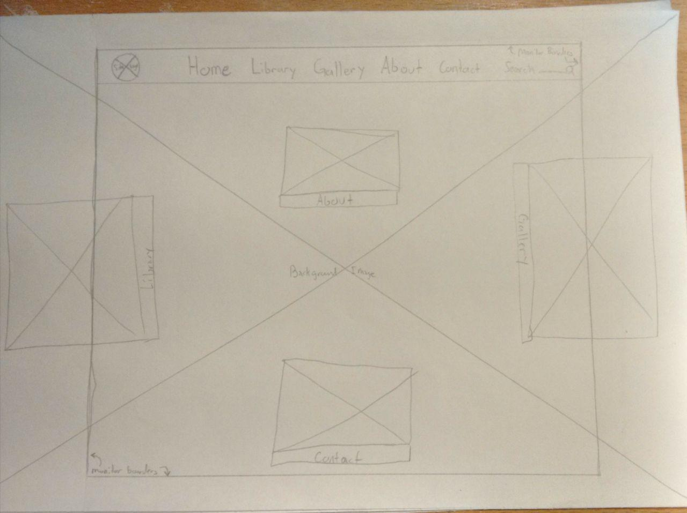

*What is the difference between padding, margin, and borders?*

Padding is the space between the content of an element, and the outer edge of an element. The margin is the space between the outer edges of separate elements. Borders are lines that trace the outside edges of elements. Borders can be solid, dotted, uniform across all four edges, invisible, etc.

*Embed the image of your sketch.*

*Free Response: Summarize your work cycle for this assignment.*

One day, I would like to create a website in which users navigate to different sections by using the arrow keys to move a character across the screen and into different buildings. I imagine it would look something like the starting town in Pokémon red version and entering each house would take the end user to a different web page. One house might contain examples of the web master’s written work, while another could contain examples of visual work. While this idea is far beyond my current ability to make web pages, I thought I would make a sketch of how that it might look in this assignment.

I started my webpage with the standard structural elements -- `doctype`, `html`, `head`, and `body` -- and standard meta elements to describe my webpage.

Once the basic structure and meta elements were in place, I began adding content to the `body` element. The first element I added was the large purple background image. I made the image large enough to extend beyond the edges of most monitors so that the end user would have to ‘scroll’ around the image to discover new web pages. If I do ever try to make a real version of this website, I would use a pixel art background that depicts a sort of town environment rather than a purple placeholder. Using the `#` selector in the `style.css` sheet, I was able to size the background image, and set its position to absolute, which removed it from the normal ‘flow’ of the webpage and allowed other elements to be placed on top of it.

After the background image, I added grey boxes, which are placeholders for buildings or links to other webpages. These are positioned with absolute values. When positioning the buildings, I used percentages, rather than pixels, to try and ensure my webpage would retain its look even if the end user zooms in. The buildings also use the pseudo function `hidden` and `hover` to change their appearance if the end user moves their cursor over one of the grey buildings. When the cursor moves over a grey box, a link appears to another webpage.

`
` elements were very important in how I later positioned elements on my webpage. This is especially true of my menu bar. All elements of the menu bar are contained within a `div` element which allowed me to give all of them a fixed position value. This causes the menu to follow the user wherever they may end up scrolling on my web page. `div` elements within the main navigation `div` also helped me style each navigation link separately, if needed, or as a group by using a common class ID. I used the class selector to add consistent amounts of padding, margins, and font styling. I used the `div` id selector to add a border to the site logo placeholder in order to separate it from the other navigation links.
