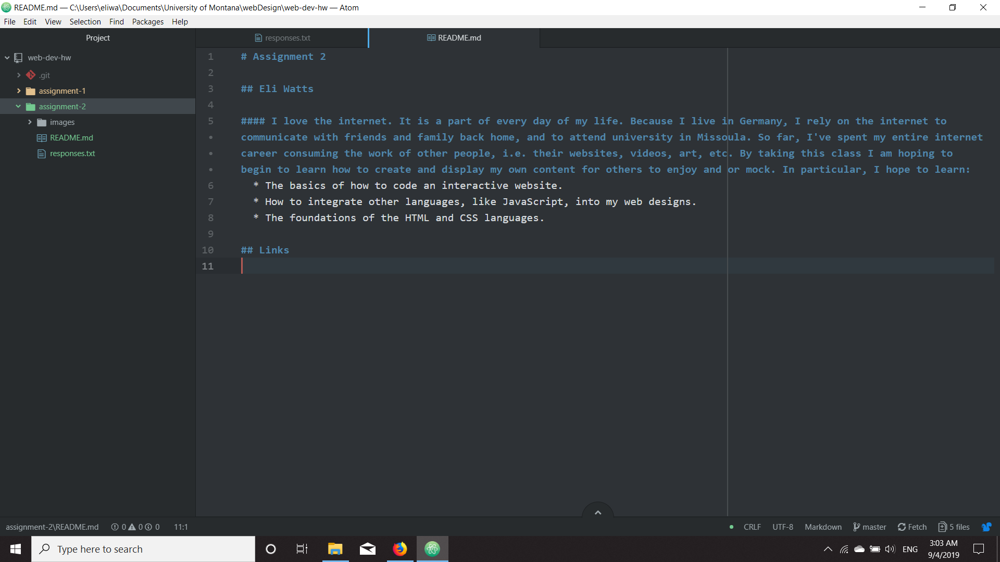

# Assignment 2

## Eli Watts

#### I love the internet. It is a part of every day of my life. Because I live in Germany, I rely on the internet to communicate with friends and family back home, and to attend university in Missoula. So far, I've spent my entire internet career consuming the work of other people, i.e. their websites, videos, art, etc. By taking this class I am hoping to begin to learn how to create and display my own content for others to enjoy and or mock. In particular, I hope to learn:
  * The basics of how to code an interactive website.
  * How to integrate other languages, like JavaScript, into my web designs.
  * The foundations of the HTML and CSS languages.

## Links

#### [America's Finest News Source](https://www.theonion.com/)

#### [My Responses](./responses.txt)

#### 
