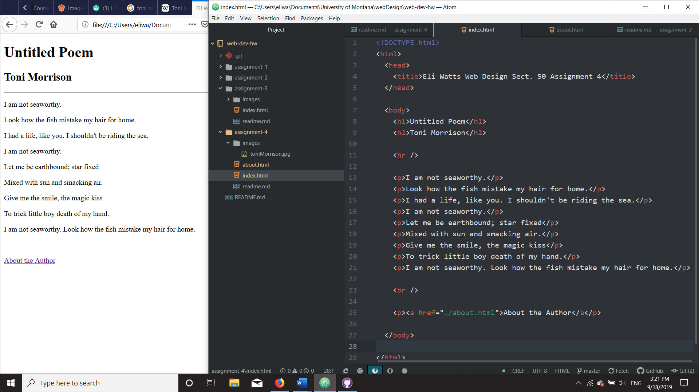

# Assignment 4

## Created by Eli Watts for MART 341 Sect. 50

### Questions:

#### Visit a site using The Wayback Machine, looking at a snapshot at least 10 years old. Where did you go? What did it look like? How has it changed?
Despite how much I dislike reddit, I seem to spend a lot of time on the site, so using the Way Back Machine, I decided to look at the front page of Reddit from September 24th, 2005. While there still are some similarities, Reddit today looks much different than its past counterpart.

Old Reddit had a very minimalistic design. The front page simply lists the top 25 user submitted links, a tool bar to sort those links by either upvotes or newest submissions, and a login/sign up box in the sidebar. Each hyperlink is accompanied by the submitting user’s username, the link’s submission time, and the amount of upvotes that link had received. Perhaps the most noticeable difference in old Reddit are the lack of comment sections and subreddits as these two features are large components of modern reddit.

New Reddit is much flashier. Links can now contain images or auto-playing videos. Subreddits now exist and can all have distinct looks with banner images, or color themes besides the old school black and white. Comment sections are a part of every submission and are often more popular than the article, or video they pertain to.

#### Summarize your experience with the GIT Module. What did you learn? What was difficult, easy, or still misunderstood?
In the GIT module, I learned the basics of HTML language and its importance in creating webpage structure. I originally learned about repositories and readme.mds in a previous coding class, but it was nice to review them again. I am fairly confident that I understood most of the materials presented so far. File structures need to be organized to ensure well working websites, the root directory should act as a suitcase for the entire website, and markup tags are used to distinguish what elements a computer will manipulate when rendering a webpage.

One topic that I still don’t fully understand is how to properly use GitHub. I understand the benefits and logic behind using version control software, but when it comes time to fork from the master branch or merge changes, I am always a little hesitant and worried that I may be doing something wrong. This may be because I haven’t practiced using different versions or branches often enough.

### Image

